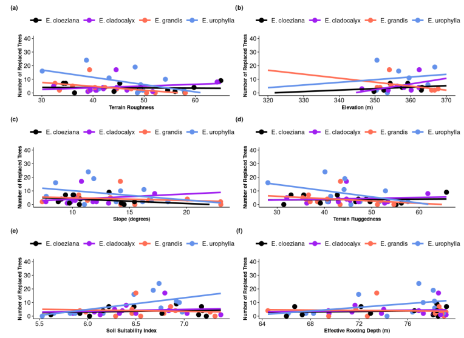

# Analysis of Factors Influencing Eucalyptus Species Replacement

This repository contains the R scripts and data for an analysis investigating the spatial and climatic factors that influence the replacement (mortality) of four Eucalyptus species. The analysis uses Negative Binomial Generalized Linear Models (GLMs) to understand how site characteristics relate to tree replacement counts.

## Table of Contents
- [Project Overview](#project-overview)
- [Key Findings](#key-findings)
- [Visualization Example](#visualization-example)
- [Repository Structure](#repository-structure)
- [Methodology](#methodology)
- [Dependencies & Setup](#dependencies--setup)
- [How to Run the Analysis](#how-to-run-the-analysis)
- [Script Descriptions](#script-descriptions)

## Project Overview

The primary goal of this research is to determine whether spatial factors such as elevation, slope, soil suitability index, terrain roughness, and terrain ruggedness, have a differential impact on the survival of four Eucalyptus species:
-   **`CA`**: *Eucalyptus cloeziana*
-   **`CX`**: *Eucalyptus cladocalyx*
-   **`EG`**: *Eucalyptus grandis*
-   **`EU`**: *Eucalyptus urophylla*

The analysis evaluates tree replacement counts at two time blanking sessions (August and October) and models these counts against various predictors to test for significant interactions between species and spatial factors.

## Key Findings

1.  **Data Distribution**: The tree replacement count data is over-dispersed and does not follow a normal or standard Poisson distribution. A **Negative Binomial distribution** was found to be the best fit for modeling the data.
2.  **Species Effect**: There are significant differences in the overall number of replaced trees among the four species at October time point.
3.  **Interaction Effects**: The relationship between several environmental predictors (e.g., elevation, terrain roughness, soil suitability) and tree replacement is not consistent across all species. This indicates that species respond differently to their environment, and these factors are crucial in predicting site-specific suitability.

## Visualization Example

The analysis generates plots to visualize the significant interaction effects. The following multi-panel plot, created by `src/Interaction.R`, shows how the relationship between the number of replaced trees (August) and various spatial factors changes for each species.



## Repository Structure

The repository is organized into data and source code directories.

```
.
├── data/
│   ├── ALLDATA.txt        # Pre-processed data for main statistical analysis
│   └── SPECIES.txt        # Raw-er data for descriptive stats and correlations
├── src/
│   ├── Descriptive-Statistics.R # Initial data exploration and summary counts
│   ├── Spearman correlations.R  # Calculates per-species predictor correlations
│   ├── Statistics-Analysis.R    # Core statistical modeling (ANOVAs, GLMs)
│   └── Interaction.R            # Generates visualizations of interaction effects
└── README.md                    # This file
```

## Methodology

1.  **Data Pre-processing**: Datasets are loaded and columns are converted to their appropriate types (e.g., `numeric`, `factor`).
2.  **Descriptive Analysis**: Initial counts of tree replacement are calculated for each species to provide a baseline understanding of mortality rates.
3.  **Correlation Analysis**: Spearman's rank correlation is used to assess the relationships between predictor variables within each species group, helping to identify potential multicollinearity.
4.  **Distribution Fitting**: The `fitdistrplus` package is used to compare Normal, Poisson, and Negative Binomial distributions for the count data. The Akaike Information Criterion (AIC) confirms that the Negative Binomial model provides the best fit.
5.  **Statistical Modeling**: Negative Binomial GLMs (`glm.nb` from the `MASS` package) are used to:
    a. Test for a main effect of `Species` on tree replacement.
    b. Test for interaction effects between `Species` and each spatial predictor (e.g., `AUG ~ Species * AvELEV`).
6.  **Post-Hoc Analysis**: Where the main effect of `Species` is significant, a Dunn's test (`dunnTest` from the `FSA` package) is performed to identify which specific species pairs differ from each other.

## Dependencies & Setup

This analysis was conducted in R. To run the scripts, you will need the following packages. You can install them all by running this command in your R console:

```R
install.packages(c(
  "ggplot2", "patchwork", "Hmisc", "xlsx", "MASS", "lme4", 
  "multcomp", "emmeans", "rcompanion", "multcompView", "FSA", 
  "nortest", "fitdistrplus"
))
```

## How to Run the Analysis

1.  **Clone the Repository:**
    ```sh
    git clone https://github.com/lanto897/Eucalyptus-Mortality.git
    cd Eucalyptus-Mortality
    ```

2.  **Set Working Directory:**
    Open R or RStudio and ensure your working directory is set to the root of the cloned repository folder. The scripts use relative paths (e.g., `"data/ALLDATA.txt"`), so this step is crucial.
    ```R
    # In R/RStudio, you can use the menu:
    # Session -> Set Working Directory -> To Source File Location (if you have a script open)
    # Or set it manually:
    # setwd("C:/path/to/your-repository-folder")
    ```

3.  **Execute the Scripts:**
    For a complete and logical workflow, run the scripts in the following order:

    1.  `src/Descriptive-Statistics.R`: Get a basic understanding of the replacement counts.
    2.  `src/Spearman correlations.R`: Examine correlations between predictors. This will generate several `.xlsx` files in your project directory.
    3.  `src/Statistics-Analysis.R`: Perform the core statistical tests (ANOVAs and interaction tests).
    4.  `src/Interaction.R`: Generate and save the final visualizations, including `combined_eucalyptus_plots.png`.

## Script Descriptions

### `src/Descriptive-Statistics.R`
-   **Purpose**: Performs initial data exploration.
-   **Input**: `data/SPECIES.txt`
-   **Output**: Prints summary counts of tree replacement for each species to the console.

### `src/Spearman correlations.R`
-   **Purpose**: Calculates Spearman's rank correlation coefficients between all environmental predictors for each species individually.
-   **Input**: `data/SPECIES.txt`
-   **Output**: Saves correlation coefficient matrices and p-value matrices to separate Excel files (e.g., `mycorEG1R.xlsx`, `mycorEG1P.xlsx`) in the root directory.

### `src/Statistics-Analysis.R`
-   **Purpose**: This is the main statistical analysis script. It determines the best data distribution, runs Negative Binomial GLMs to test for main and interaction effects, and performs post-hoc tests.
-   **Input**: `data/ALLDATA.txt`
-   **Output**: Prints model summaries, ANOVA tables, and post-hoc test results to the console. It also generates boxplots to visualize main effects.

### `src/Interaction.R`
-   **Purpose**: Dedicated to visualizing the interaction effects identified in the main analysis.
-   **Input**: `data/ALLDATA.txt`
-   **Output**: Creates and saves a high-resolution, multi-panel plot (`combined_eucalyptus_plots.png`) to the root directory, and displays other interaction plots in the plot pane.
